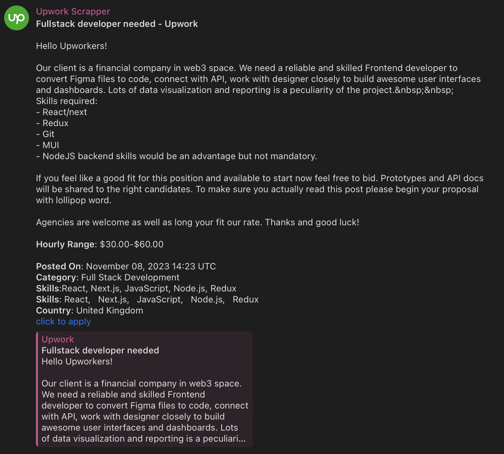

# Upwork Scrapper

This JavaScript code is a script for a Telegram bot that fetches data from an Upwork RSS feed and sends it to a specified Telegram chat. The script uses several libraries, including `node-telegram-bot-api` for interacting with the Telegram API, `rss-parser` for parsing the RSS feed, and `lowdb/node` for a lightweight JSON database.

The script begins by importing the necessary modules and initializing some constants. The `dotenv/config` import is used to load environment variables from a `.env` file. These variables include the URL for the Upwork RSS feed, the query parameters for the feed, and the authentication tokens for both Upwork and Telegram.

The `TelegramBot` object is initialized with the bot token from the environment variables and set to polling mode. This means the bot will continuously check for new updates (like messages or commands) from the Telegram server.

The bot is set up to respond to the `/start` command. When a user sends this command, the bot will reply with a greeting message.

The `checkForNewLinks` function is an asynchronous function that fetches and parses the RSS feed from the Upwork URL. It then iterates over each item in the feed. If the link of an item is not already in the database, it logs the link, adds it to the database, and sends a message to the specified Telegram chat with the item's title and content. The content is formatted to replace certain HTML tags with newline characters and to remove excessive spaces.

The code ends abruptly, so it's likely there's more code following this that handles calling the `checkForNewLinks` function and managing the database updates.

## Usage

Install dependencies:

```bash
yarn
```
Run script:

```bash
yarn start
```

## Preview



